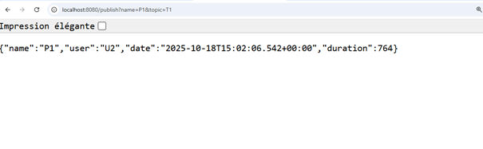

**Kafka Streams with Spring Cloud Stream - PageEvent Processing**

This project demonstrates a Spring Cloud Stream application using Kafka Streams to produce, consume, and process `PageEvent` objects in real-time.

**Overview**

The application includes:
- Producing `PageEvent` objects to a Kafka topic (`T1`).
- Consuming `PageEvent` objects and displaying them in the console.
- Processing events in real-time using Kafka Streams to filter and aggregate data.
- Visualizing processed data via a reactive endpoint.

**Project Structure**

The project is organized under the package `org.example.kafkastreamsspringcloudstreamtp1`.

**PageEvent Model**

The `PageEvent` class is a record with:
- `name`: Page name.
- `user`: User associated with the event.
- `date`: Event timestamp.
- `duration`: Event duration in milliseconds.

```java
package org.example.kafkastreamsspringcloudstreamtp1.events;

import java.util.Date;

public record PageEvent(String name, String user, Date date, long duration) {
}
```

**Publishing PageEvent to Topic T1**

A REST controller (`PageEventController`) publishes `PageEvent` objects to a Kafka topic (`T1`).

```java
package org.example.kafkastreamsspringcloudstreamtp1.controllers;

import org.example.kafkastreamsspringcloudstreamtp1.events.PageEvent;
import org.springframework.beans.factory.annotation.Autowired;
import org.springframework.cloud.stream.function.StreamBridge;
import org.springframework.http.MediaType;
import org.springframework.web.bind.annotation.GetMapping;
import org.springframework.web.bind.annotation.RestController;

import java.util.Date;
import java.util.Random;

@RestController
public class PageEventController {
    private StreamBridge streamBridge;

    public PageEventController(StreamBridge streamBridge) {
        this.streamBridge = streamBridge;
    }

    @GetMapping("/publish")
    public PageEvent send(String name, String topic) {
        PageEvent event = new PageEvent(name, Math.random() > 0.5 ? "U1" : "U2", new Date(), 10 + new Random().nextInt(1000));
        streamBridge.send(topic, event);
        return event;
    }
}
```

**Usage**:
- Send a `PageEvent` to `T1` via GET request: `/publish?name=pageName&topic=T1`.

- The event is published and returned in the response.
 

**Consuming PageEvent from Topic T1**

A consumer (`PageEventHandler`) consumes `PageEvent` objects from `T1` and prints details to the console.

```java
package org.example.kafkastreamsspringcloudstreamtp1.hanndlers;

import org.example.kafkastreamsspringcloudstreamtp1.events.PageEvent;
import org.springframework.context.annotation.Bean;
import org.springframework.stereotype.Component;

@Component
public class PageEventHandler {

    @Bean
    public Consumer<PageEvent> pageEventConsumer() {
        return (input) -> {
            System.out.println("************");
            System.out.println(input.toString());
            System.out.println("************");
        };
    }
}
```

**Configuration**:
- Bind the consumer to `T1` in `application.properties`:
  ```properties
  spring.cloud.stream.bindings.pageEventConsumer-in-0.destination=T1
  ```

**Result**:
- Events published to `T1` are received and logged to the console.
  

**Producing PageEvent Every 200ms (Supplier)**

A supplier (`pageEventSupplier`) sends `PageEvent` objects to `T1` every 200ms.

```java
package org.example.kafkastreamsspringcloudstreamtp1.hanndlers;

import org.example.kafkastreamsspringcloudstreamtp1.events.PageEvent;
import org.springframework.context.annotation.Bean;
import org.springframework.stereotype.Component;

import java.util.Date;
import java.util.Random;

@Component
public class PageEventHandler {

    @Bean
    public Supplier<PageEvent> pageEventSupplier() {
        return () -> new PageEvent(
                Math.random() > 0.5 ? "P1" : "P2",
                Math.random() > 0.5 ? "U1" : "U2",
                new Date(),
                10 + new Random().nextInt(10000)
        );
    }
}
```

**Configuration**:
- Configure the supplier in `application.properties`:
  ```properties
  spring.cloud.stream.bindings.pageEventSupplier-out-0.destination=T1
  spring.cloud.stream.poller.fixed-delay=200
  ```

**Result**:
- A `PageEvent` is sent to `T1` every 200ms with random `name` (`P1` or `P2`), `user` (`U1` or `U2`), and `duration`.
  

**Real-Time Processing with Kafka Streams**

A Kafka Streams function (`kStreamFunction`) processes `PageEvent` streams, filtering events with `duration > 100`, grouping by page name, and counting within a 5-second window.

```java
package org.example.kafkastreamsspringcloudstreamtp1.hanndlers;

import org.apache.kafka.common.serialization.Serdes;
import org.apache.kafka.streams.KeyValue;
import org.apache.kafka.streams.kstream.Grouped;
import org.apache.kafka.streams.kstream.KStream;
import org.apache.kafka.streams.kstream.Materialized;
import org.apache.kafka.streams.kstream.TimeWindows;
import org.example.kafkastreamsspringcloudstreamtp1.events.PageEvent;
import org.springframework.context.annotation.Bean;
import org.springframework.stereotype.Component;

import java.time.Duration;

@Component
public class PageEventHandler {

    @Bean
    public Function<KStream<String, PageEvent>, KStream<String, Long>> kStreamFunction() {
        return (stream) ->
                stream.filter((k, v) -> v.duration() > 100)
                        .map((k, v) -> new KeyValue<>(v.name(), 0L))
                        .groupByKey(Grouped.with(Serdes.String(), Serdes.Long()))
                        .windowedBy(TimeWindows.of(Duration.ofSeconds(5)))
                        .count(Materialized.as("count-store"))
                        .toStream()
                        .map((k, v) -> new KeyValue<>(k.key(), v));
    }
}
```

**Configuration**:
- Set input/output bindings in `application.properties`:
  ```properties
  spring.cloud.stream.bindings.kStreamFunction-in-0.destination=T1
  spring.cloud.stream.bindings.kStreamFunction-out-0.destination=processed-topic
  spring.cloud.stream.kafka.streams.binder.application-id=page-event-processor
  ```

**Result**:
- Events with `duration > 100` are filtered, grouped by `name`, and counted in 5-second windows, stored in `count-store`.
  

**Visualizing Processed Data**

A reactive endpoint (`/analytics`) streams real-time event counts using Server-Sent Events (SSE).

```java
package org.example.kafkastreamsspringcloudstreamtp1.controllers;

import org.apache.kafka.streams.KeyValue;
import org.apache.kafka.streams.kstream.Windowed;
import org.apache.kafka.streams.state.KeyValueIterator;
import org.apache.kafka.streams.state.QueryableStoreTypes;
import org.apache.kafka.streams.state.ReadOnlyWindowStore;
import org.springframework.beans.factory.annotation.Autowired;
import org.springframework.cloud.stream.binder.kafka.streams.InteractiveQueryService;
import org.springframework.http.MediaType;
import org.springframework.web.bind.annotation.GetMapping;
import org.springframework.web.bind.annotation.RestController;
import reactor.core.publisher.Flux;

import java.time.Duration;
import java.time.Instant;
import java.util.HashMap;
import java.util.Map;

@RestController
public class PageEventController {

    @Autowired
    private InteractiveQueryService interactiveQueryService;

    @GetMapping(path = "/analytics", produces = MediaType.TEXT_EVENT_STREAM_VALUE)
    public Flux<Map<String, Long>> analytics() {
        return Flux.interval(Duration.ofSeconds(1))
                .map(sequence -> {
                    Map<String, Long> stringLongMap = new HashMap<>();
                    ReadOnlyWindowStore<String, Long> windowStore = interactiveQueryService.getQueryableStore("count-store", QueryableStoreTypes.windowStore());
                    Instant now = Instant.now();
                    Instant from = now.minusMillis(5000);
                    KeyValueIterator<Windowed<String>, Long> fetchAll = windowStore.fetchAll(from, now);
                    while (fetchAll.hasNext()) {
                        KeyValue<Windowed<String>, Long> next = fetchAll.next();
                        stringLongMap.put(next.key.key(), next.value);
                    }
                    return stringLongMap;
                });
    }
}
```

**Result**:
- The `/analytics` endpoint streams a map of page names and event counts every second, based on the last 5 seconds of data from `count-store`.
  
- Visualisation :
  

**Configuration Summary**

Add to `application.properties`:
```properties
spring.cloud.stream.bindings.pageEventConsumer-in-0.destination=T1
spring.cloud.stream.bindings.pageEventSupplier-out-0.destination=T1
spring.cloud.stream.bindings.kStreamFunction-in-0.destination=T1
spring.cloud.stream.bindings.kStreamFunction-out-0.destination=processed-topic
spring.cloud.stream.poller.fixed-delay=200
spring.cloud.stream.kafka.streams.binder.application-id=page-event-processor
```

**Running the Application**

1. **Set up Kafka**:
  - Ensure a Kafka broker is running and `T1` is created.

2. **Run the Spring Boot application**:
  - Use an IDE or run `mvn spring-boot:run`.

3. **Test the Producer**:
  - GET request: `http://localhost:8080/publish?name=TestPage&topic=T1`.
  - Verify consumer output in the console.

4. **Test the Supplier**:
  - Supplier sends `PageEvent` to `T1` every 200ms.
  - Verify consumer output.

5. **Test the Analytics Endpoint**:
  - Access `http://localhost:8080/analytics` in a browser.
  - 
6**Test the Visualisation Endpoint**:
- Access `http://localhost:8080/index.html` in a browser.

**Results**

- **Producer**: Publishes `PageEvent` to `T1`.
- **Consumer**: Logs `PageEvent` from `T1`.
- **Supplier**: Sends `PageEvent` to `T1` every 200ms.
- **Kafka Streams**: Processes events (`duration > 100`), groups by page name, counts in 5-second windows.
- **Analytics**: Streams real-time event counts via `/analytics`.

